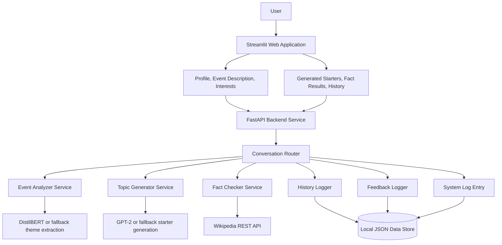

# Technical Architecture - Personalized Networking Assistant

## Layers

- User interface: Streamlit app for inputs, generated suggestions, fact checks, history, and feedback.
- API layer: FastAPI routes with Pydantic validation and Swagger documentation.
- Service layer: Theme extraction, starter generation, fact verification, history logging, feedback logging, and audit logging.
- Storage layer: Local JSON files in `data/`.

