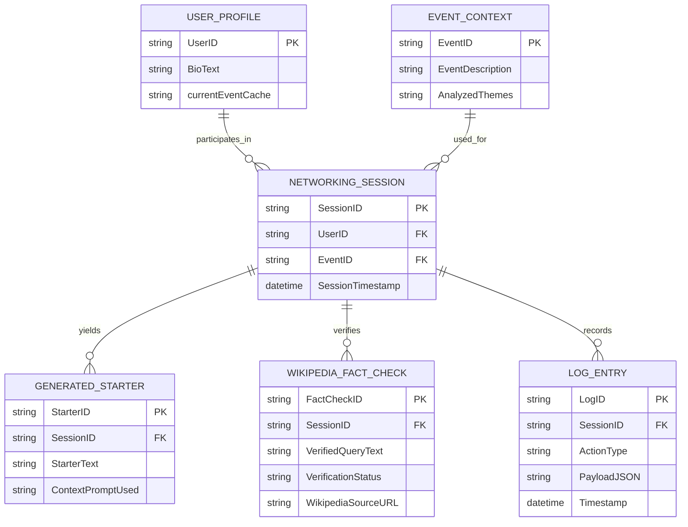

# ER Diagram - Personalized Networking Assistant

```mermaid
erDiagram
    USER_PROFILE ||--o{ NETWORKING_SESSION : participates_in
    EVENT_CONTEXT ||--o{ NETWORKING_SESSION : used_for
    NETWORKING_SESSION ||--o{ GENERATED_STARTER : yields
    NETWORKING_SESSION ||--o{ WIKIPEDIA_FACT_CHECK : verifies
    NETWORKING_SESSION ||--o{ LOG_ENTRY : records

    USER_PROFILE {
        string UserID PK
        string BioText
        string currentEventCache
    }

    EVENT_CONTEXT {
        string EventID PK
        string EventDescription
        string AnalyzedThemes
    }

    NETWORKING_SESSION {
        string SessionID PK
        string UserID FK
        string EventID FK
        datetime SessionTimestamp
    }

    GENERATED_STARTER {
        string StarterID PK
        string SessionID FK
        string StarterText
        string ContextPromptUsed
    }

    WIKIPEDIA_FACT_CHECK {
        string FactCheckID PK
        string SessionID FK
        string VerifiedQueryText
        string VerificationStatus
        string WikipediaSourceURL
    }

    LOG_ENTRY {
        string LogID PK
        string SessionID FK
        string ActionType
        string PayloadJSON
        datetime Timestamp
    }
```

